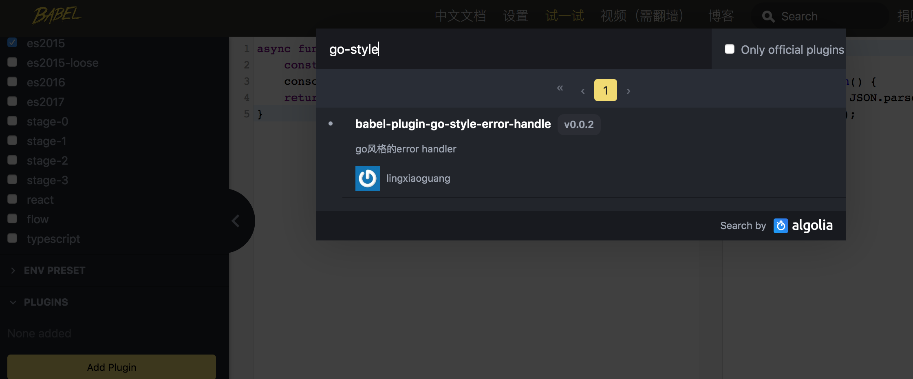

# babel-plugin-go-style-error-handle-babel-plugin

go风格的error handler的 eslint plugin

# 栗子：

## 转换前：

```
async function fun(){
    const res = await JSON.parse('//');
    console.log(res);
    return res;
}
```
转换后
```
"use strict";

async function fun() {
  var res = await(async function () {
    try {
      return {
        result: await JSON.parse('//')
      };
    } catch (e) {
      return {
        error: e,
        result: null
      };
    }
  })();
  ;
  console.log(res);
  return res;
}
```

## 在线演示
1. 打开[babel试一试](https://www.babeljs.cn/repl#?babili=false&browsers=&build=&builtIns=false&spec=false&loose=false&code_lz=IYZwngdgxgBAZgV2gFwJYHsLyQCgJQDeAUDKTFJiMjAE4CmIMAvDMAO7CrUBSAygPIA5AHQAHYDRB0cAcgD0cmXgDcJMhQgh0AGzrDt6AOY56IFWtL1kCGllOqAvkA&debug=false&forceAllTransforms=false&shippedProposals=false&circleciRepo=&evaluate=false&fileSize=false&timeTravel=false&sourceType=module&lineWrap=true&presets=es2015&prettier=false&targets=&version=7.5.4)
2. 点击添加插件,搜索babel-plugin-go-style-error-handle




## 测试
```
npm run test
```

## 使用
```
yarn global add babel-plugin-go-style-error-handle
```
```
{
  plugins: 'babel-plugin-go-style-error-handle'
}
```


## 其他

本来是想实现:=语法转换的，看了下文档发现babel parser[没有插件机制](https://github.com/babel/babel/issues/6694#issuecomment-436216635)，只能fork下来改源码，目前没有深入研究。所以只是转换了赋值操作。


还有很多问题啊，只是研究性质的。


